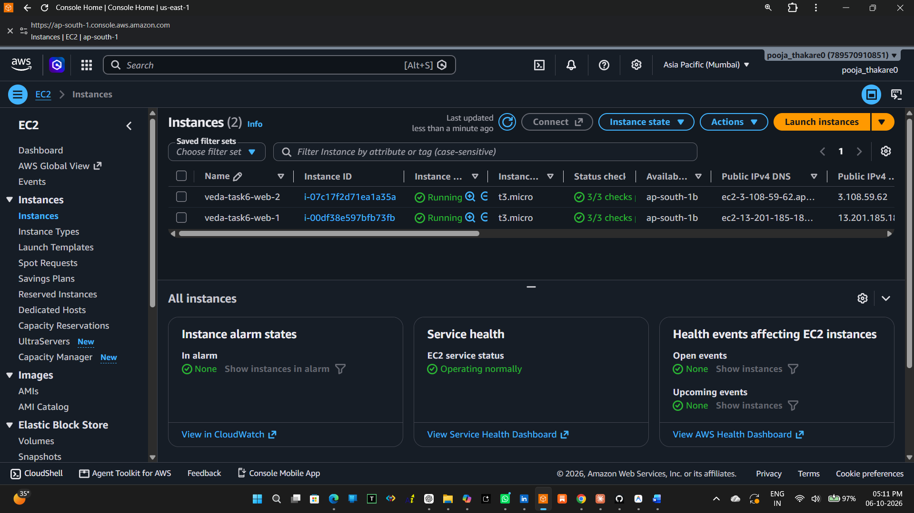
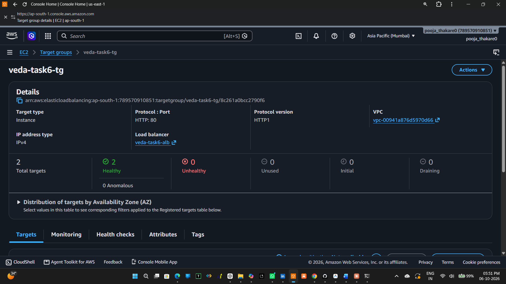
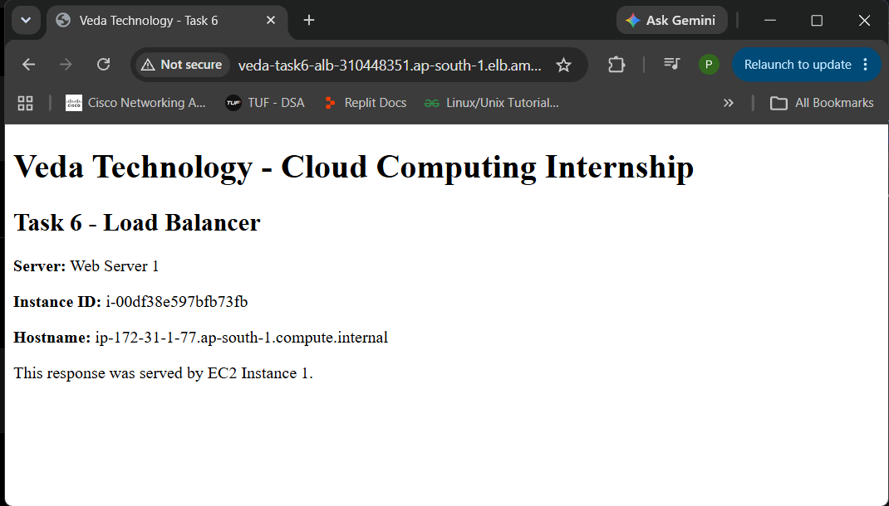
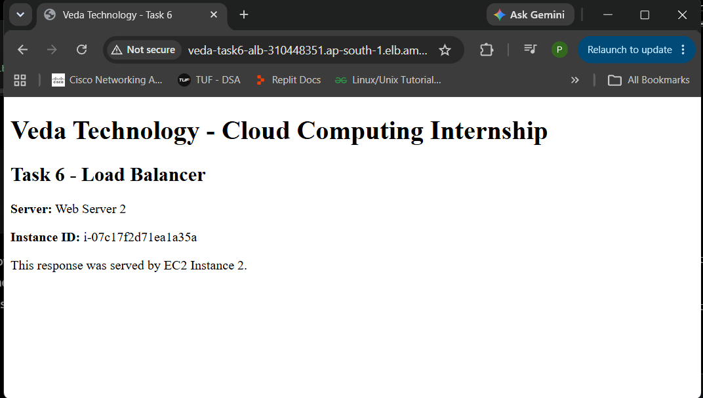
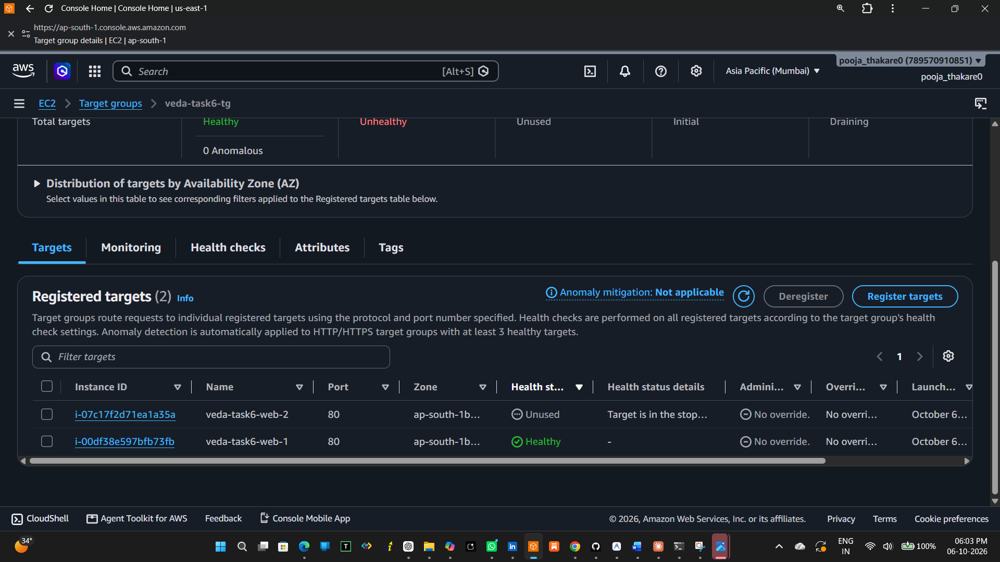
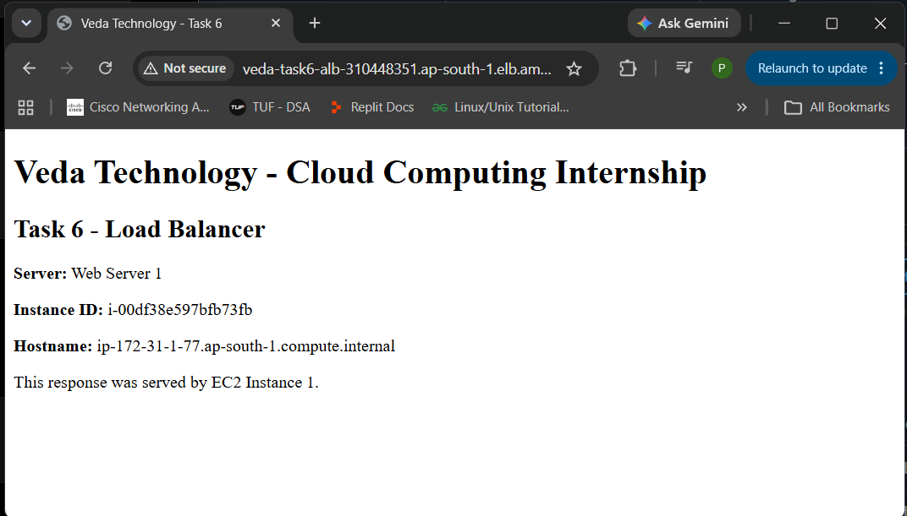

# Veda Technology Cloud Computing Internship — Task 6

## Set Up a Basic Load Balancer Across Two Instances

This task was completed as part of the Veda Technology Cloud Computing Internship.

The objective was to deploy two web servers on Amazon EC2 and configure an AWS Application Load Balancer (ALB) to distribute HTTP traffic between them.

---

## Architecture

```text
                         Internet
                            |
                            v
                 +----------------------+
                 | Application Load     |
                 | Balancer (ALB)       |
                 | HTTP : 80            |
                 +----------+-----------+
                            |
                    +-------+-------+
                    |               |
                    v               v
             +-------------+   +-------------+
             | EC2 Web 1   |   | EC2 Web 2   |
             | Nginx       |   | Nginx       |
             | Server 1    |   | Server 2    |
             +-------------+   +-------------+

```
## AWS Services Used
- Amazon EC2
- Application Load Balancer (ALB)
- Target Groups
- Amazon VPC
- Security Groups
- Nginx
- EC2 Instance Connect
  
## Resources Created
|          Resource         |        Name         |
|---------------------------|---------------------|
| EC2 Instance 1            | `veda-task6-web-1`  |
| EC2 Instance 2            | `veda-task6-web-2`  |
| Target Group              | `veda-task6-tg`     |
| Application Load Balancer | `veda-task6-alb`    |
| ALB Security Group        | `veda-task6-alb-sg` |
| EC2 Security Group        | `veda-task6-ec2-sg` |


## EC2 Configuration
Both instances were launched in the Mumbai AWS Region (ap-south-1) using Amazon Linux 2023 and t3.micro instance types.
## Web Server 1
- Instance: veda-task6-web-1
- Instance ID: i-00df38e597bfb73fb
- Web server: Nginx
- HTTP port: 80
## Web Server 2
- Instance: veda-task6-web-2
- Instance ID: i-07c17f2d71ea1a35a
- Web server: Nginx
- HTTP port: 80

## Security Configuration
## Application Load Balancer Security Group
| Protocol | Port |   Source    |
|----------|-----:|-------------|
| HTTP     | 80   | `0.0.0.0/0` |


## EC2 Security Group
| Protocol | Port |         Source               |
|----------|-----:|------------------------------|
|   HTTP   |  80  |      `veda-task6-alb-sg`     |
|   SSH    |  22  | My IP / EC2 Instance Connect |


The EC2 instances were configured to receive HTTP traffic through the Application Load Balancer.

## Target Group
**Target group:** veda-task6-tg

**Configuration:**
- Target type: Instances
- Protocol: HTTP
- Port: 80
- Protocol version: HTTP/1.1
- Health check protocol: HTTP
- Health check path: /
The target group contained both EC2 instances.
Both targets successfully reached the Healthy state.

## Application Load Balancer
**Load balancer:** veda-task6-alb

**Configuration:**
- Type: Application Load Balancer
- Scheme: Internet-facing
- IP address type: IPv4
- Listener: HTTP : 80
- Default action: Forward to veda-task6-tg

# ALB DNS
veda-task6-alb-310448351.ap-south-1.elb.amazonaws.com


## Load Balancing Test
The ALB DNS endpoint was accessed from a web browser.
Requests successfully reached both backend instances.

**Server 1 Response**
Server: Web Server 1
Instance ID: i-00df38e597bfb73fb

**Server 2 Response**
Server: Web Server 2
Instance ID: i-07c17f2d71ea1a35a

This confirmed that the Application Load Balancer was successfully distributing traffic across the two EC2 instances.


## Failover Test
To verify load balancer health monitoring and failover:
1. Web Server 2 was stopped manually.
2. The target group detected that the instance was stopped.
3. Web Server 2 changed to Unused — Target is in the stopped state.
4. Web Server 1 remained Healthy.
5. The ALB continued serving requests through Web Server 1.
The ALB continued responding successfully after one backend instance was stopped.

## Screenshots
### 1. Both EC2 Instances Running
 
 
### 2. Target Group — Two Healthy Targets
 
 
### 3. ALB Response — Web Server 1
 
 
### 4. ALB Response — Web Server 2
 
 
### 5. One Target Stopped
 
 
### 6. ALB Failover
 
 
## Result
Successfully configured an AWS Application Load Balancer across two EC2 web servers running Nginx. Traffic was successfully distributed between both instances, and the ALB continued serving requests through the healthy instance after one backend server was stopped.

 ## Conclusion
This task provided practical experience with AWS Application Load Balancers, target groups, EC2, Nginx, security groups, health checks, traffic distribution, and basic failover handling.
